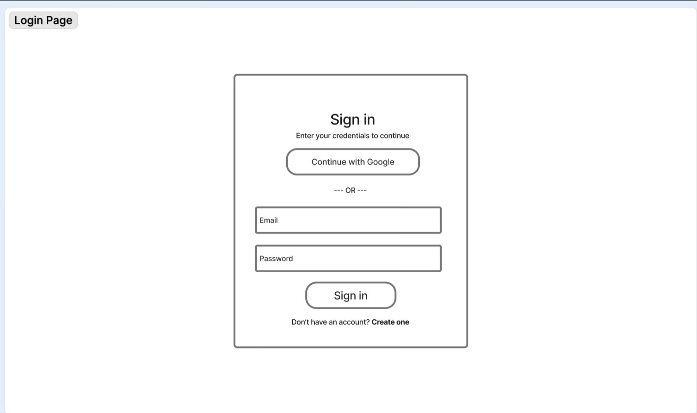
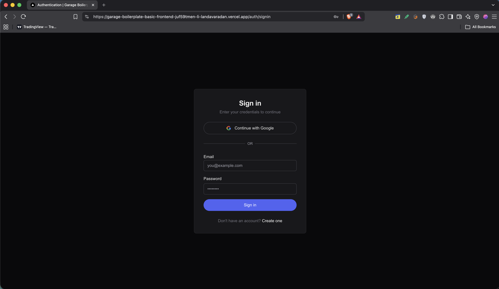
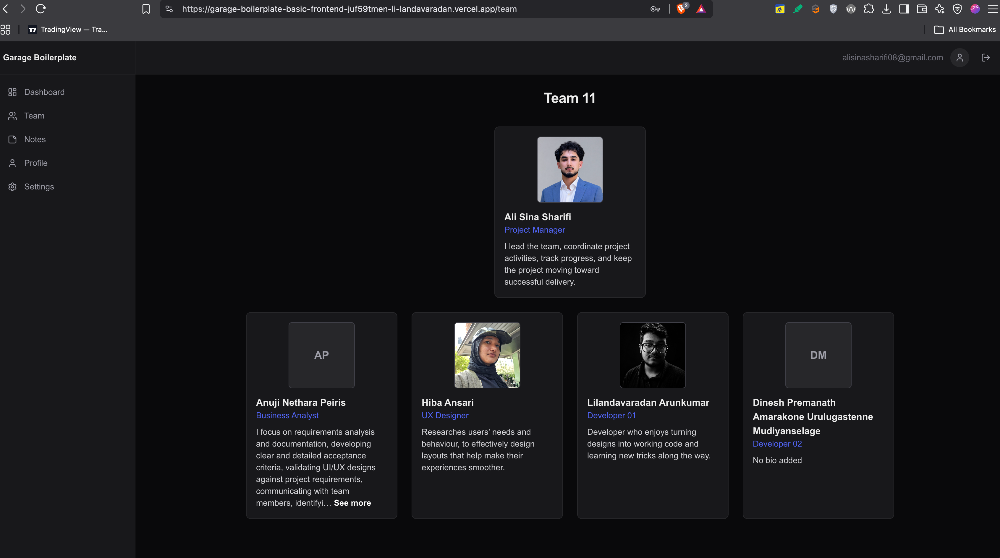
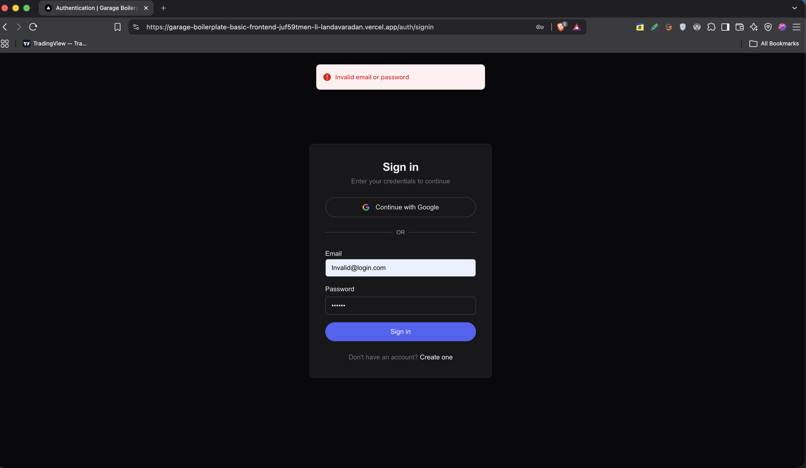
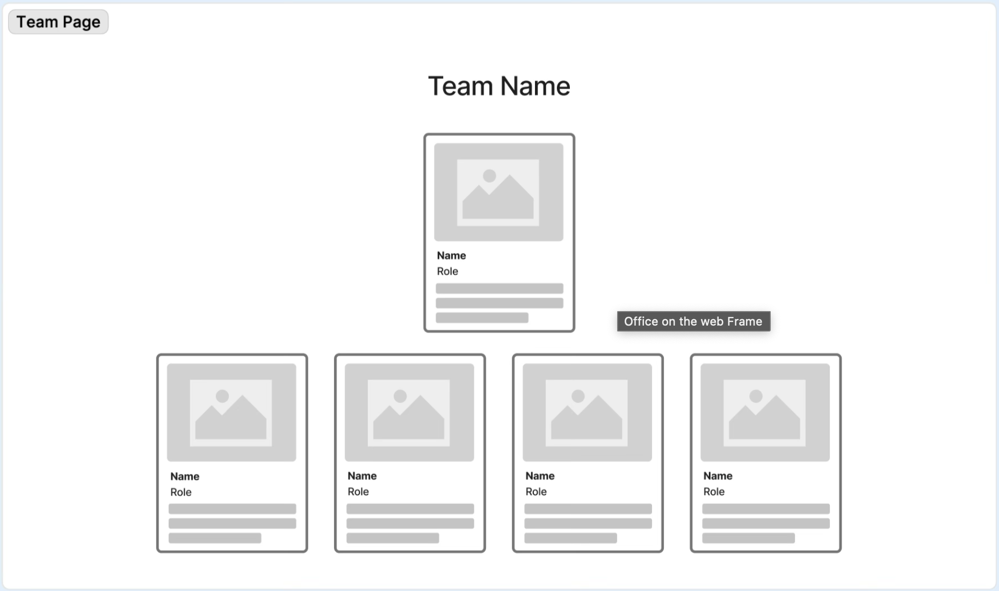
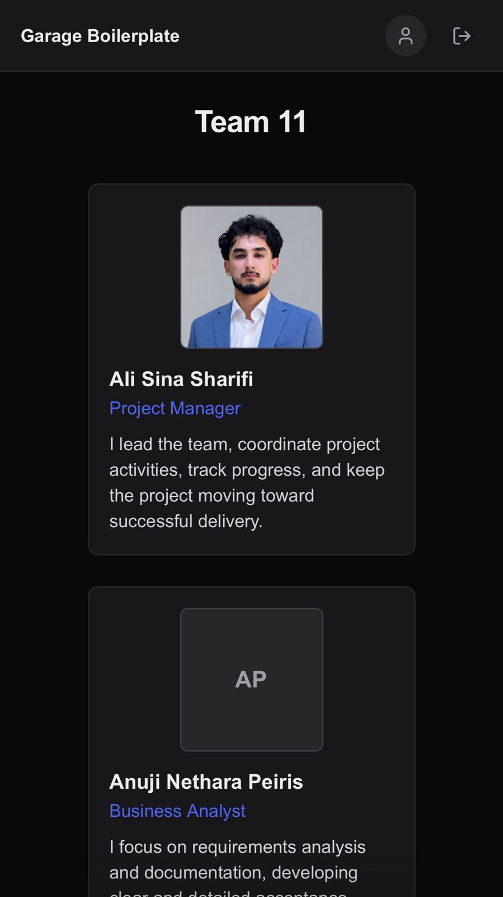
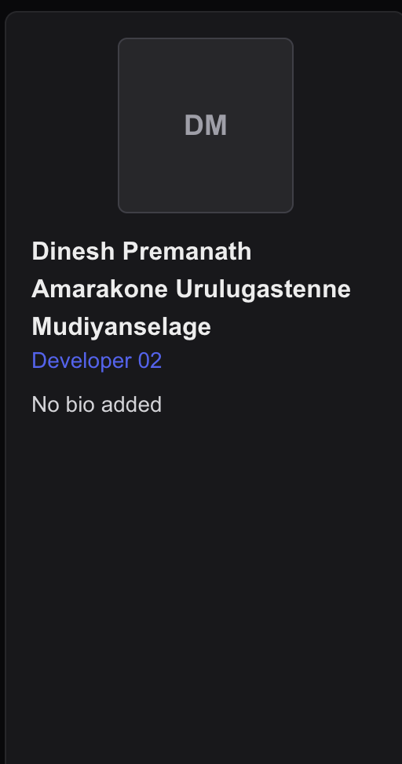
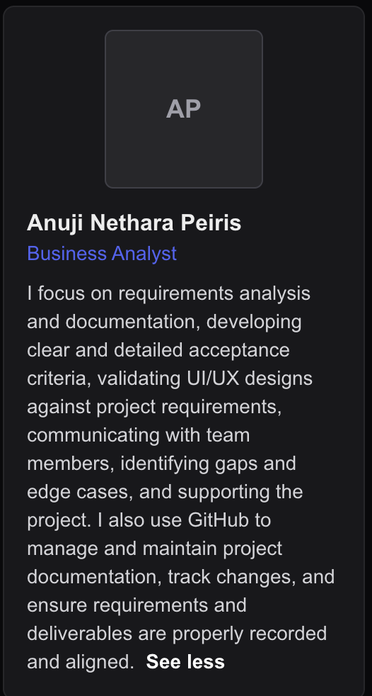
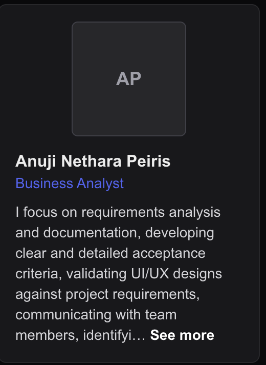
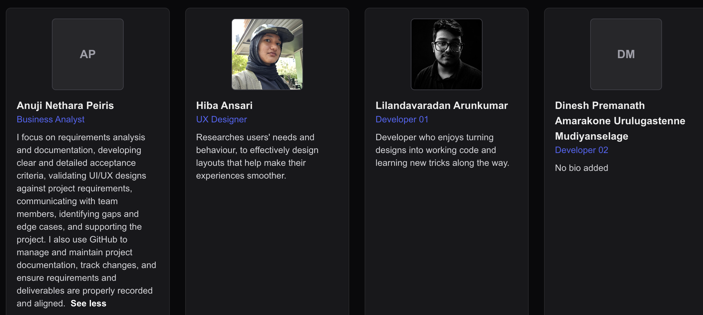

## Testing Scope

The scope of this testing covers the deployed implementation of the **Bootstrap login-page restyling and Team page** for Week 3 & 4 – Team 11.

The testing covers the following areas:

- Deployment availability – confirming that the deployed application loads successfully without errors.
- Login-page presentation – verifying that the login page contains the approved elements and styling.
- Valid Login – verifying that users can successfully log in using valid credentials.
- Invalid login credentials – verifying that incorrect credentials are rejected and do not authenticate the user.
- Required login fields left empty – verifying that field validation prevents login when required fields are not completed.
- Team page access – verifying the behaviour when attempting to access the Team page without an authenticated session.
- Team name display – confirming that the correct team name is displayed.
- Team member information – verifying that required member information is displayed correctly.
- Missing member photos – checking that missing photos do not cause any issues.
- Long member names and roles – verifying that unusually long text does not break the page layout.
- Missing member blurbs – checking that missing blurbs are handled appropriately.
- Responsive design – verifying the Team page presentation across different desktop and mobile screen sizes.

## Testing Results

| ID | Test | Expected Result | Actual Result | Status | Evidence |
|---|---|---|---|---|---|
| T01 | Open deployed URL | Login page loads without an application error. | The deployed application successfully loaded without errors. | Pass | [Deployed application](https://garage-boilerplate-basic-frontend-git-fe-fdf70a-li-landavaradan.vercel.app/auth/signin) |
| T02 | Compare login page with approved design | Required login elements and approved styling are displayed. | Login elements and styling match the Figma mock-up. Exception: Email and Password labels are positioned above the input fields. | Pass |   | 
| T03 | Log in with valid credentials | User is authenticated and taken to the Team page. | Valid credentials successfully authenticated the user and the Team page loaded successfully. | Pass |  |
| T04 | Attempt an invalid login | Login is rejected using the existing validation behaviour. | Invalid credentials were rejected and login was denied. | Pass |  |
| T05 | Open Team page URL while logged out | User is redirected to the login page. | User was successfully redirected to the login page. | Pass |  |
| T06 | Review Team page content | Team name and member photo, name, role and biography are displayed. | Team page loaded successfully and displayed the team name, member photos, names, roles and biographies. | Pass |  |
| T07 | Test desktop layout | Cards are readable, aligned and consistent with the desktop design. | The desktop layout and styling matched the UX design and met the requirements. | Pass |   |
| T08 | Test mobile layout | Content responds correctly without overlap or horizontal overflow. | Content loaded successfully and maintained the expected structure on mobile, consistent with the mock-up. | Pass |  |
| T09 | Test long member name and role on desktop and mobile | Long values remain readable without horizontal overflow or broken alignment. | Long member names and roles remained readable and maintained the page structure across desktop and mobile views. | Pass |  |
| T10 | Test long biography | Biography is collapsed and can be expanded and collapsed correctly. | Long biographies were truncated and the “See more” and “See less” functionality allowed users to expand and collapse the content. | Pass |   |
| T11 | Test missing photo | Member initials or the approved placeholder are displayed. | Missing profile photos displayed the approved placeholder. | Pass |  |
| T12 | Test missing biography | Approved placeholder text is displayed. | The placeholder text “No bio added” was displayed when a biography was unavailable. | Pass |  |
